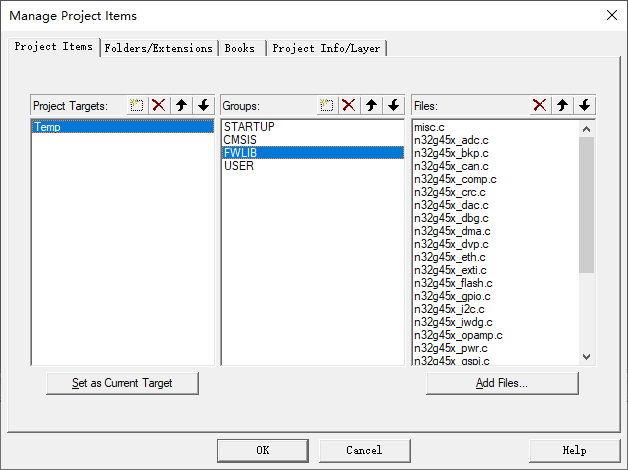

## 一、新建一个文件夹

​	用于存放工程文件

## 二、新建工程

### 1. 新建Prj

​	"Project"->"New uVision Project.."，然后选择保存位置为刚才创建的文件夹，设置工程名字为"N32G455.uvproj"。

### 2. 选择芯片型号

​	选择"N32G455REL7"，点击OK。


### 3. 选择外设

​	直接取消（不用这种方式）


### 4. 空工程创建完毕


## 三、拷贝库文件

将“N32G455xx_V3.0.0\6-软件开发套件(Software Development Kit)\Nationstech.N32G45x_Library.2.1.0”路径下的“firmware文件夹”拷贝至上面新建的文件内（可以考虑将文件夹内所有文件改为只读文件，防止误修改）


创建“User文件夹”，在文件夹内创建“main.c”


```c
// main.c 内容
#include <stdio.h>

int mian()
{
	return 0;    
}

```


## 四、添加库文件到工程

配置文件路径


Group:STARTUP ->"\firmware\CMSIS\device\startup\startup_n32g45x.s"


Group:CMSIS->"\firmware\CMSIS\device\system_n32g45x.c"


Group:FWLIB->"\firmware\n32g45x_std_periph_driver\src\*.c"



Group:USER->"mian.c"


添加完成


## 五、包含头文件路径

选择魔术棒


"C/C++(AC6)"->"Include Paths":

- .\firmware\CMSIS\core
- .\firmware\CMSIS\device
- .\firmware\n32g45x_std_periph_driver\inc
- .\User


## 六、其他

### 1. 添加宏定义

"C/C++(AC6)"->"Define"->"N32G45X, USE_STDPERIPH_DRIVER"


### 2. 编译版本


### 3. JLink（可选）


### 4. 下载完成自动运行（可选）


### 5. 生成HEX文件


## 七、编译


